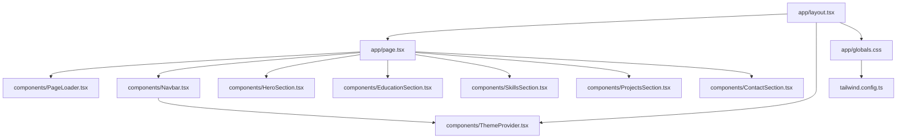

# 📁 项目结构说明

本文档详细说明了项目的文件组织结构和各个文件的作用。

## 🌳 完整目录树

```
个人简历网站/
│
├── 📁 app/                          # Next.js App Router 目录
│   ├── 📄 layout.tsx               # 根布局组件（全局布局）
│   ├── 📄 page.tsx                 # 首页（集成所有组件）
│   └── 📄 globals.css              # 全局样式文件
│
├── 📁 components/                   # React 组件目录
│   ├── 📄 ThemeProvider.tsx        # 主题切换上下文提供者
│   ├── 📄 PageLoader.tsx           # 页面加载动画组件
│   ├── 📄 Navbar.tsx               # 导航栏组件
│   ├── 📄 HeroSection.tsx          # 首屏/英雄区域组件
│   ├── 📄 EducationSection.tsx     # 教育背景组件
│   ├── 📄 SkillsSection.tsx        # 技能专长组件
│   ├── 📄 ProjectsSection.tsx      # 项目经历组件
│   └── 📄 ContactSection.tsx       # 联系方式组件
│
├── 📁 public/                       # 静态资源目录
│   └── (可放置图片、图标等静态文件)
│
├── 📁 node_modules/                 # npm 依赖包（自动生成）
│
├── 📄 package.json                  # 项目配置和依赖清单
├── 📄 package-lock.json             # 依赖版本锁定文件
├── 📄 tsconfig.json                 # TypeScript 配置
├── 📄 tailwind.config.ts            # Tailwind CSS 配置
├── 📄 postcss.config.js             # PostCSS 配置
├── 📄 next.config.js                # Next.js 配置
├── 📄 .eslintrc.json                # ESLint 代码规范配置
├── 📄 .gitignore                    # Git 忽略文件配置
│
├── 📄 README.md                     # 项目说明文档
├── 📄 QUICKSTART.md                 # 快速开始指南
├── 📄 DEPLOYMENT.md                 # 部署指南
└── 📄 PROJECT_STRUCTURE.md          # 本文档
```

## 📂 目录详解

### 1️⃣ `/app` - 应用核心目录

Next.js 15 使用 App Router，所有路由和页面都在这个目录下。

#### `layout.tsx`
**作用**：全局布局文件，包裹所有页面
**包含**：
- HTML 基础结构
- 全局样式导入
- 字体引入
- SEO 元数据配置
- ThemeProvider 包裹

```tsx
// 关键代码示例
export const metadata: Metadata = {
  title: "张云阶 - 云计算工程师",
  description: "...",
};
```

#### `page.tsx`
**作用**：网站首页（`/` 路由）
**包含**：
- PageLoader 加载动画
- Navbar 导航栏
- 各个 Section 组件的整合

#### `globals.css`
**作用**：全局 CSS 样式
**包含**：
- Tailwind 指令导入
- CSS 变量定义
- 自定义工具类（glass-effect, gradient-text 等）
- 全局样式重置

### 2️⃣ `/components` - 组件目录

所有可复用的 React 组件都放在这里。

#### `ThemeProvider.tsx` 🌓
**作用**：管理全局主题状态（深色/浅色模式）
**功能**：
- 提供 `theme` 和 `toggleTheme` 方法
- 持久化主题选择（localStorage）
- 自动应用主题 class

#### `PageLoader.tsx` ⏳
**作用**：首屏加载动画
**特点**：
- 0-100% 进度显示
- "Initializing Cloud Environment..." 文字
- 平滑淡出动画
- Framer Motion 动画效果

#### `Navbar.tsx` 📑
**作用**：网站导航栏
**功能**：
- 滚动时毛玻璃效果
- 响应式设计（移动端抽屉菜单）
- 主题切换按钮
- GitHub 链接
- 简历下载按钮
- 平滑滚动导航

#### `HeroSection.tsx` 🦸
**作用**：首屏英雄区域
**功能**：
- 打字机效果（循环显示角色）
- 动态 SVG 云拓扑动画
- 渐变背景气泡动画
- 个人信息展示
- CTA 按钮

#### `EducationSection.tsx` 🎓
**作用**：教育背景展示
**功能**：
- 时间轴设计
- 学校信息
- 荣誉奖项
- 核心课程标签
- 入场动画

#### `SkillsSection.tsx` 💪
**作用**：技能专长展示
**功能**：
- 4 类技能卡片
- 3D 倾斜悬停效果
- 渐变图标背景
- 技能列表动画
- 核心能力概述

#### `ProjectsSection.tsx` 🚀
**作用**：项目经历展示
**功能**：
- Bento Grid 布局
- 动态网格背景动画
- 技术标签徽章
- GitHub 和 Demo 链接
- STAR 原则项目描述

#### `ContactSection.tsx` 📧
**作用**：联系方式和页脚
**功能**：
- 社交卡片（微信、邮箱、GitHub、掘金）
- 点击复制功能
- Toast 提示
- 页脚信息
- 呼吸灯效果

### 3️⃣ `/public` - 静态资源目录

存放图片、图标、字体等静态文件。

**使用方式**：
```tsx
// 访问 public 目录下的文件

```

### 4️⃣ 配置文件详解

#### `package.json`
**作用**：项目元数据和依赖管理
**关键字段**：
```json
{
  "scripts": {
    "dev": "next dev",      // 开发模式
    "build": "next build",  // 构建
    "start": "next start"   // 生产模式
  },
  "dependencies": {
    // 运行时依赖
  },
  "devDependencies": {
    // 开发依赖
  }
}
```

#### `tsconfig.json`
**作用**：TypeScript 编译配置
**关键配置**：
```json
{
  "compilerOptions": {
    "paths": {
      "@/*": ["./*"]  // 路径别名
    }
  }
}
```

#### `tailwind.config.ts`
**作用**：Tailwind CSS 自定义配置
**关键配置**：
- 自定义颜色
- 自定义动画
- 自定义字体
- 响应式断点

#### `next.config.js`
**作用**：Next.js 框架配置
**关键配置**：
- 图片域名白名单
- 重定向规则
- 环境变量
- 构建优化

#### `.eslintrc.json`
**作用**：代码质量检查规则
**配置**：继承 Next.js 推荐规则

#### `.gitignore`
**作用**：指定 Git 忽略的文件
**忽略内容**：
- `node_modules/`
- `.next/`
- `.env*.local`
- 构建产物

### 5️⃣ 文档文件

#### `README.md`
**作用**：项目主文档
**内容**：项目介绍、特性、技术栈、快速开始

#### `QUICKSTART.md`
**作用**：快速开始指南
**内容**：新手友好的分步指导

#### `DEPLOYMENT.md`
**作用**：部署指南
**内容**：详细的 Vercel 部署步骤

#### `PROJECT_STRUCTURE.md`
**作用**：项目结构说明（本文档）

## 🔄 文件依赖关系



## 📝 命名规范

### 组件命名
- **格式**：PascalCase（首字母大写）
- **示例**：`HeroSection.tsx`, `Navbar.tsx`

### 变量命名
- **格式**：camelCase（驼峰命名）
- **示例**：`skillCategories`, `isScrolled`

### 常量命名
- **格式**：UPPER_SNAKE_CASE（全大写下划线）
- **示例**：`API_URL`, `MAX_ITEMS`

### CSS 类名
- **格式**：kebab-case（短横线连接）
- **示例**：`glass-effect`, `gradient-text`

## 🎯 添加新功能指南

### 添加新的 Section 组件

1. 在 `components/` 创建新组件文件：
```tsx
// components/NewSection.tsx
"use client";
import { motion } from "framer-motion";

export default function NewSection() {
  return (
    <section id="new-section" className="py-20">
      {/* 组件内容 */}
    </section>
  );
}
```

2. 在 `app/page.tsx` 中导入并使用：
```tsx
import NewSection from "@/components/NewSection";

export default function Home() {
  return (
    <>
      {/* 其他组件 */}
      <NewSection />
    </>
  );
}
```

3. 在 `components/Navbar.tsx` 添加导航链接：
```tsx
{ label: "新功能", href: "#new-section" }
```

### 添加新页面

在 `app/` 目录创建新文件夹：

```
app/
├── about/
│   └── page.tsx
└── blog/
    └── page.tsx
```

访问路径：
- `/about` → `app/about/page.tsx`
- `/blog` → `app/blog/page.tsx`

## 🔧 修改指南

### 修改颜色
👉 编辑 `tailwind.config.ts` 中的 `colors` 配置

### 修改字体
👉 编辑 `app/layout.tsx` 中的 Google Fonts 链接

### 修改动画
👉 编辑各组件中的 `framer-motion` 配置

### 修改内容
👉 直接编辑对应组件中的数据对象

## 📦 构建产物

运行 `npm run build` 后生成：

```
.next/
├── cache/              # 构建缓存
├── server/             # 服务端代码
├── static/             # 静态资源
└── BUILD_ID            # 构建标识
```

这些文件会自动部署到 Vercel。

## 🚀 部署流程

```
本地开发
   ↓
git commit
   ↓
git push
   ↓
Vercel 自动检测
   ↓
自动构建
   ↓
自动部署
   ↓
生产环境上线
```

## 💡 最佳实践

1. **组件拆分**：每个组件只负责一个功能
2. **样式隔离**：使用 Tailwind 的实用类
3. **性能优化**：使用 `framer-motion` 的 `viewport={{ once: true }}`
4. **类型安全**：充分利用 TypeScript 类型检查
5. **代码复用**：提取公共逻辑为自定义 Hook

---

**希望这份文档能帮助您更好地理解项目结构！如有疑问，欢迎查阅其他文档。📚**
